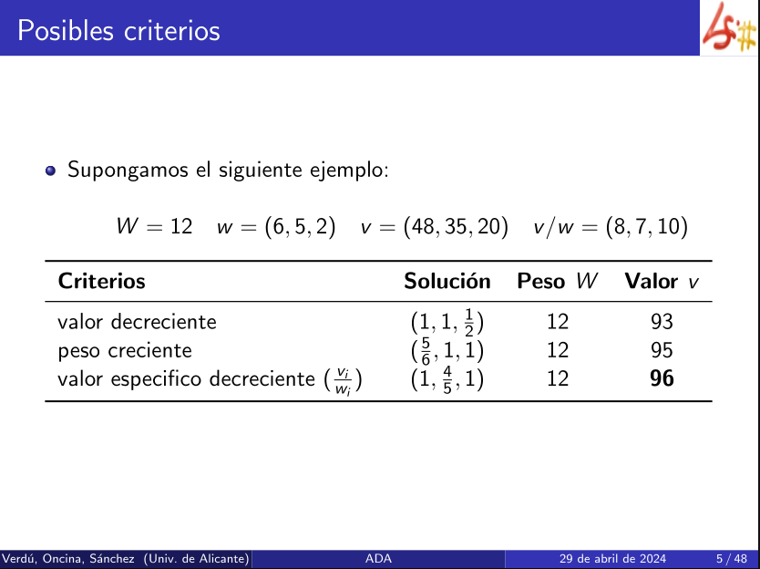

> [!example] Datos
> - $v_i$ son los valores del total
> - $w_i$ son los pesos
> - $W$ es la capacidad de la mochila

- Seleccionar un conjunto de objetos de manera que:
	- no se sobrepase W
	- valor transportado máximo
	- se pueden fraccionar los objetos
- Para resolverlo se necesita un **criterio de selección**.
- Los elementos de la **solución** no se ordenan, se representan de la misma manera en que está la lista de pesos. El criterio de selección determina el total de cada objeto que entra en la mochila. 



___
## Valor decreciente

$v = (48,25,20)$

Se coge el primer objeto (**48**), se verifica si puede entrar en la mochila. Pesa **6**, con lo cual puede entrar entero (**1**). 
$W = 6$.
Siguiente objeto. 

Segundo objeto (**35**), puede entrar entero (**1**) porque pesa **5**. 
$W = 1$.
Siguiente objeto

Tercer objeto (**20**), no puede entrar entero porque el peso libre de la mochila es de **1**.
Como su peso es de **2**, solo puede entrar $\frac{1}{2}$.

| Solución              | Peso $W$ | Valor $v$         |
| --------------------- | -------- | ----------------- |
| $(1, 1, \frac{1}{2})$ | 12       | 48 + 35 + 10 = 93 |

___
## Peso creciente

$w = (6,5,2)$

Primer objeto ($w=2$). Cabe entero (**1**).
$W = 10$
Siguiente objeto.

Segundo objeto ($w=5$). Cabe entero (**1**). 
$W=5$
Siguiente objeto.

Tercer objeto ($w=6$). No cabe entero, para que quepa en la mochila hay que dividirlo. La fracción que entra es de $\frac{\Large 5}{\Large 6}$. 

| Solución              | Peso $W$ | Valor $v$         |
| --------------------- | -------- | ----------------- |
| $(\frac{5}{6}, 1, 1)$ | 12       | 40 + 35 + 20 = 95 |

___
## Valor específico decreciente $(\frac{v_i}{w_i})$

$v/w = (8,7,10)$

Primer objeto (**20**). Cabe entero (**1**).
$W=8$
Siguiente objeto.

Segundo objeto (**48**). Cabe entero (**1**).
$W=2$
Siguiente objeto.

Tercer objeto (**35**). No cabe entero, para que queda en la mochila hay que dividirlo. La fracción que entra es de $\frac{\Large 4}{\Large 5}$.

| Solución              | Peso $W$ | Valor $v$         |
| --------------------- | -------- | ----------------- |
| $(1, \frac{4}{5}, 1)$ | 12       | 48 + 28 + 20 = 96 |


# Torema. Solución óptima


$(x_i - y_i) \frac{v_i}{w_i} \ge (x_i - y_i) \frac{v_j}{w_j}$ siempre se cumple.

___
# Implementación
## Valor óptimo

```c++
double knapsack( const vector &v, const vector &w, double W){
	vector<size_t> idx(w.size());
	for( size_t i = 0; i < idx.size(); i++) idx[i] = i;
	
	sort( begin(idx), end(idx), 
		[&v,&w]( size_t x, size_t y ){
			return v[x]/w[x] > v[y]/w[y];
		}
	);
	double acc_v = 0.0; // acumulador 
	for( auto i : idx ) {
		if( w[i] >= W ) {
			// Si el objeto no cabe en la mochila se mete la fracción que cabe y fin
			acc_v += W/w[i] * v[i]; 
			break;
		}
		// Si el objeto cabe en la mochila se añade en el acumulador
		acc_v += v[i];
		// después se actualiza el peso de la mochila
		W -= w[i];
	}
	return acc_v;
}
```

```c++
sort( begin(idx), end(idx), [&v,&w]( size_t x, size_t y ){
			return v[x]/w[x] > v[y]/w[y];
		}
	);
```

El sort ordena el vector idx según los valores específicos.

```c++
[&v,&w]( size_t x, size_t y ){
	return v[x]/w[x] > v[y]/w[y];
}
```

Es una función lambda que devuelve un booleano. `[&v,&w]` le especifica los vectores `v` y `w` que va a utilizar en la función lambda. 
## Complejidad temporal

n = número de elementos.
Cuando hay un sort la complejidad temporal es de $O(n \log n)$, luego:

- $O(n \log n)$ por el sort
- $O(n)$, por el bucle final
- 
**Complejidad temporal**: $O(n \log n)$

___
# Vector óptimo

Cuando además se quieren saber los objetos. Igual que el anterior pero añadiendo el vector.

```c++
double knapsack( const vector &v, const vector &w, double W){
	vector<size_t> idx(w.size());
	for( size_t i = 0; i < idx.size(); i++) idx[i] = i;
	
	sort( begin(idx), end(idx), [&v,&w]( size_t x, size_t y ){
			return v[x]/w[x] > v[y]/w[y];
		}
	);
	
	vector<double> x(w.size(),0); // vector para guardar los objetos (y/o freacciones)
	double acc_v = 0.0;
	for( auto i : idx ) {
		if( w[i] >= W ) {
			// Si el objeto no cabe en la mochila se mete la fracción que cabe y fin
			acc_v += W/w[i] * v[i];
			x[i] = W/w[i];
			break;
		}
		// Si el objeto cabe en la mochila se añade en el acumulador
		acc_v += v[i];
		// después se actualiza el peso de la mochila
		W -= w[i];
		x[i] = 1.0; // si cabe entero
	}
	return x;
}
```


