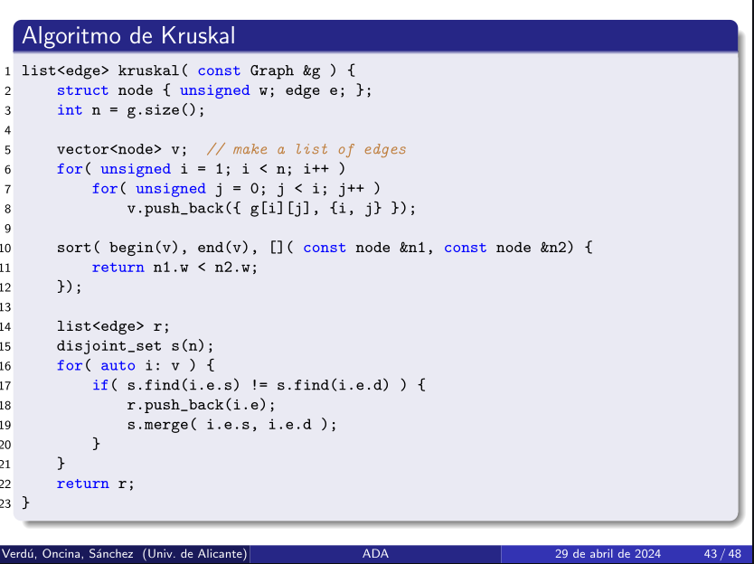

> Añadir aristas evitando ciclos

Kruskal va construyendo un bosque de árboles que va uniendo hasta que acaba con un árbol de recubrimiento de coste mínimo.

- Comienza con un conjunto de árboles (bosque) y agrega aristas para unir estos árboles.
- Se enfoca en las aristas, seleccionando la de menor peros que no forme un ciclo hasta conectar todos los nodos en un solo árbol.

Es más eficiente en grafos dispersos, donde el número de aristas es mayor.



- Se recorre el vector y se ordena con una función lambda de menor a mayor.
- Después de ordenarlo, se recorre la lista de forma ordenada, comprobando primero si el arco seleccionado `r` va de un bloque a otro distinto. Si es un arco elegible se incluye en el vector de la solución y se juntan los bloques.
## Complejidad

```c++
for( auto i: v ) {
	if( s.find(i.e.s) != s.find(i.e.d) ) {
		r.push_back(i.e);
		s.merge( i.e.s, i.e.d );
	}
}
```

El `for` final tiene una complejidad de **n** porque se recorre todo el vector. Además al utilizar conjuntos disjuntos, cualquier combinación de operaciones **find** y **merge** es lineal en función del tamaño del conjunto (**n**). (find y merge son operaciones constantes). 
Dependerá del número de operaciones de dentro del bucle. 
### Complejidad Kruskal

Siempre que haya un método **sort** la complejidad será logarítmica. 
Complejidad **n** por el bucle final y **log n** por el sort. 

**Complejidad:** $O(n·\log n)$

___
# Comparativa con Prim

[Algoritmo de Prim](Algoritmo%20de%20Prim.md)

Para el peor caso el número de arcos de un grafo es $E \in O(V^2)$.
Cuando el grafo está completamente lleno la complejidad del de **Kruskal** es peor que la de **Prim**, $O(V^2·\log V)$ frente a $O(V^2)$.
**Kruskal** es mejor cuando el grafo es muy disperso. Cuando al representarlo con la matriz de adyacencia hay muchos huecos. 
**Prim** es mejor cuando el grafo es completo (lleno).
