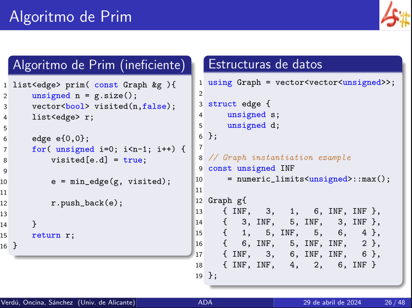

> Hacer crecer el árbol

- Comienza con un único nodo arbitrario y expande ese árbol agregando la arista de menor peso que conecta un nodo dentro del árbol a un nodo fuera del árbol.
- Se enfoca en los nodos, agregando el nodo más cercano al árbol existente. 

Es más eficiente en grafos densos, donde la estructura de datos de la cola de prioridad ayuda a gestionar las aristas de manera más efectiva.

De un **conjunto de vértices** se coge uno al azar y se añade al conjunto de vértices explorados en cada paso.
Busca el arco de mínimo peso que va de un **vértice explorado** a uno **no explorado** y se añade a la solución.
Si el grafo tiene **n** elementos, tendrá **n-1** arcos.
# Ineficiente



> [!note] Datos
> **edge**: representa un arco
> **s**: vértice de salida
> **d**: vértice destino
> **n**: tamaño del grafo

```c++
struct edge { // arcos
	unsigned s; // salida
	unsigned d; // destino
}

// Algoritmo principal
list<edge> prim( const Graph &g ){
	unsigned n = g.size();
	vector<bool> visited(n,false);
	list<edge> r;
	
	edge e{0,0}; //arco ficticio por comodidad, solo interesa el destino
	for( unsigned i=0; i < n-1; i++){ // grafo n, n-1 arcos
		visited[e.d] = true;
		e = min_edge(g, visited);
		r.push_back(e);
	}
	return r;
}

edge min_edge(const Graph &g, const vector &visited){
	unsigned n = g.size();
	unsigned min = numeric_limits<unsigned>::max();
	edge e;
	
	// recorre todos los arcos y hace la comprobación
	for ( unsigned i = 0; i < n; i++ )
		for( unsigned j = 0; j < n; j++ )
			if( visited[i] && !visited[j] ){
				if( g[i] [j] < min ) {
					min = g[i][j];
					e = {i, j};
				}
	return e;
}
```

- `min_edge()` comprueba en el árbol g el arco con menos peso que va de un **vértice visitado** a uno **no visitado**. 
## Complejidades

- `min_edge`: $O(V^2)$, dos bucles for
- `prim`: $O(V^3)$, min_edge + for.
### Mejora

- No es necesario recorrer todos los arcos cada vez
- Guarda para cada **vértice no visitado** arco de peso mínimo procedente de un **vértice visitado**.
- Si el mínimo cambia se debe al último vértice añadido, con lo que no es necesario comparar otra vez el resto de vértices ya que ese valor se almacena. 

___
# Algoritmo de Prim con índices

```c++
list<edge> prim(const Graph &g) {
    unsigned n = g.size();
    vector<bool> visited(n, false);  // visited vertex
    vector<unsigned> lcv(n,0);       // lowest cost vertex, (tamañoVec,valorInicial)
    list<edge> r;
	
    edge e{0,0};
    for (unsigned i = 0; i < n-1; i++) {
        visited[e.d] = true;
        update_idx(g, lcv, e.d);  // update the index
		
        e = min_edge(g, lcv, visited);
        r.push_back(e);
    }
    return r;
}
```
## Actualizar índices

Para cada vértice j, si el costo de conexión desde el último vértice añadido (**nv**) a j es menor que el costo actual (**lcv[j]**), se actualiza **lcv[j]** con **nv**. 

```c++
// Actualizar índices
void update_idx(const Graph &g, vector<unsigned> &lcv, unsigned nv) {
    unsigned n = g.size();
    for (unsigned j = 0; j < n; j++) {
        if (g[lcv[j]][j] > g[nv][j]) {
            lcv[j] = nv;
        }
    }
}
```
## Buscar mejor arco

Encuentra el arco de menor coste que conecta un nuevo vértice al árbol. Itera sobre todos los vértices. Si el vértice no ha sido visitado y el coste es menor que el mínimo actual, actualiza el mínimo y almacena el arco. 

```c++
// Buscar mejor arco
edge min_edge(const Graph &g, const vector<unsigned> &lcv, const vector<bool> &visited){
    unsigned n = g.size();
    unsigned min = numeric_limits<unsigned>::max();
    edge e;
    for (unsigned j = 0; j < n; j++) {
        if (!visited[j] && g[lcv[j]][j] < min) {
            min = g[lcv[j]][j];
            e = { lcv[j], j };
        }
    }
    return e;
}
```

**Complejidad:** $O(n^2)$
$O(n)$ (min_edge) + $O(n)$ (update_index), realizado $(n-1)$ veces
$(O(n) + O(n))·(n-1)$ = $O(n^2)$ 

La complejidad es $O(n^2)$ porque las llamadas a update_index y min_edge son sucesivas, no están anidadas como en el anterior supuesto.

___
# Comparativa con Kruskal 

[Comparativa con Prim](Algoritmo%20de%20Kruskal.md#comparativa-con-prim)