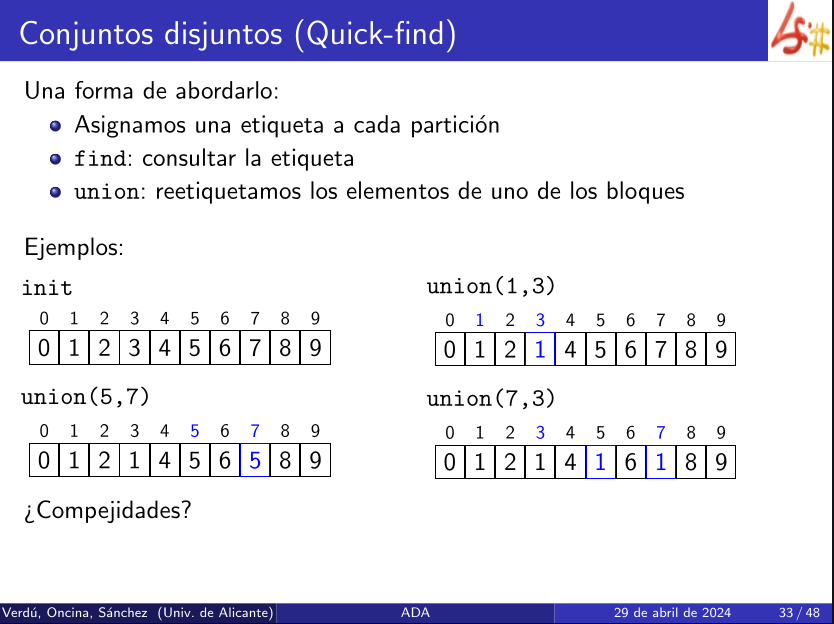
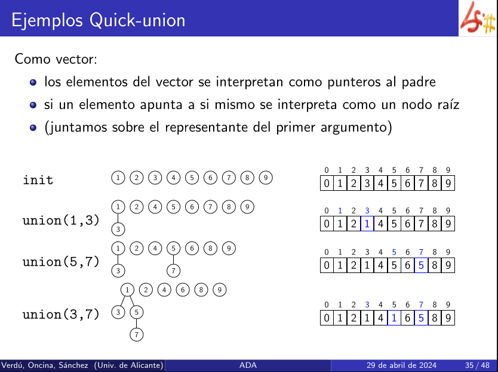
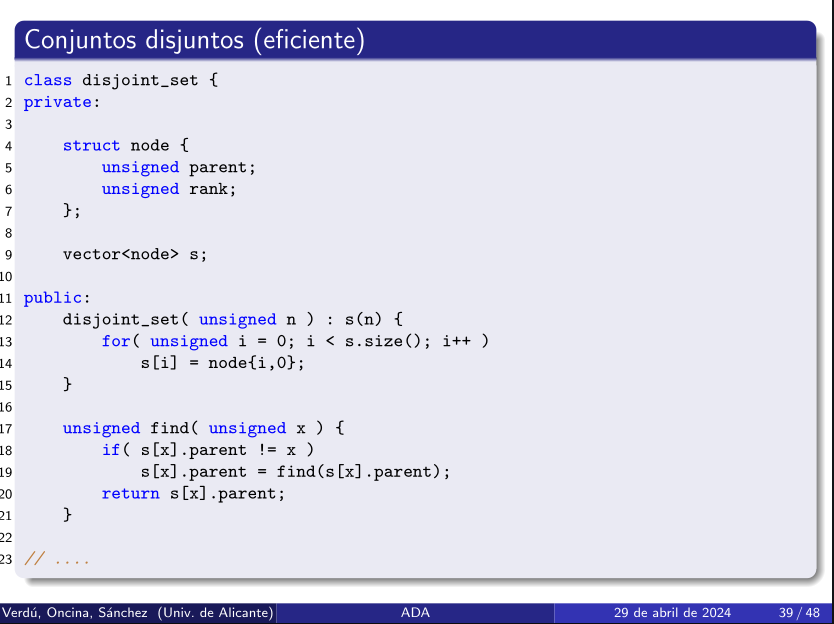

# Conjuntos disjuntos (ineficiente)

NO VORAZ, pero necesario para Kruskal.

[Algoritmo de Kruskal](Algoritmo%20de%20Kruskal.md)

Se trabaja sobre particiones, las cuales son subconjuntos de un conjunto principal tales que la unión de estos, sin solaparse, formen el conjunto de elementos totales.

```
Objetos: {0, 1, 2, 3, 4, 5, 6, 7, 8, 9}
```

___
## Inicialización

Cada elemento del conjunto a un bloque distinto. 

```
Inicialización: {{0}, {1}, {2}, {3}, {4}, {5}, {6}, {7}, {8}, {9}}
```

```
conjunto disjunto: {{0, 1, 2}, {3, 4, 7, 8, 9}, {5}, {6}}
```

Cada bloque tiene un representante elegido por un criterio, por ejemplo el menor número. Luego los representantes del bloque anterior son 0, 3, 5 y 6.

`find(.)` devuelve el representante del bloque donde se encuentra el parámetro. 

`union(8,2)` une los conjuntos que contienen a 8 y 2

```
{{0, 1, 2, 3, 4, 7, 8, 9}, {5}, {6}}
```

___
## Quick-find

Asigna una etiqueta por cada partición.
**find** consulta la etiqueta .
**union** vuelve a etiquetar los elementos de uno de los bloques. 


## Complejidad

- find: $O(1)$
- union: $O(n)$, recorre el vector
## Quick-union

Representando las particiones como árboles.




## Mejoras


## Ejemplos


Siempre se une el árbol pequeño a la raíz del más grande. Si son iguales da igual.

___
# Conjuntos disjuntos (eficiente)



