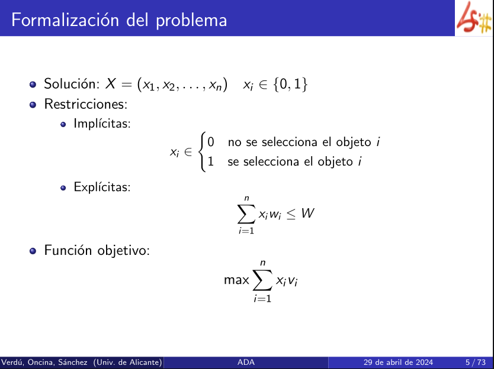

> [!note] datos
> n objetos
> v valores
> w pesos

>[!question] Objetivo
> Seleccionar un conjunto de objetos de forma que no se sobrepase el peso límite W y el valor transportado sea máximo.
> Objetos no fragmentables y los pesos son valores reales.
# Restricciones



- Las soluciones son vectores de 0 o 1. 
- Los valores de x van desde 0 a 1.
- La suma de las soluciones debe ser menor o igual que el peso que aguanta la mochila.

___
# Tipos de soluciones

Se construye una tabla con todas las posibles soluciones. 

> [!abstract] Datos
> W  = 16
> w = (2, 8, 7)
> v = (20, 40, 49)

| Solucion  | Peso | Valor |                 |
| :-------: | :--: | :---: | --------------- |
| (0, 0, 0) |  0   |   0   | FACTIBLE        |
| (0, 0, 1) |  7   |  49   | FACTIBLE        |
| (0, 1, 0) |  8   |  40   | FACTIBLE        |
| (0, 1, 1) |  15  |  89   | SOLUCIÓN ÓPTIMA |
| (1, 0, 0) |  2   |  20   | FACTIBLE        |
| (1, 0, 1) |  9   |  69   | VORAZ           |
| (1, 1, 0) |  10  |  60   | FACTIBLE        |
| (1, 1, 1) |  17  |  109  | NO FACTIBLE     |
- La solución que tenga el valor más alto es la óptima.
## Generación de todas las combinaciones

```c++
void comb(size_t k, vector<unsigned> &x){
	if( k == x.size() ) { // It is a leaf
		cout << x << endl; // to overload
		return;
	}
	for ( unsigned j = 0; j < 2; j++) {
		x[k]=j; // nueva alternativa
		comb(k+1, x); // expand
	}
}

void comb(size_t n){
	vector<unsigned> x(n);
	comb(0, x);
}
```

- Se comienza en 0 y se avanza de 1 en 1.
- Primero se comprueba si estamos en un hoja
- Si no es una hoja. Se muestra el x[k] en dos llamadas, para 0 y para 1 y se expande para rellenar todos los casos. 
- Se muestra toda la primera columna de soluciones.

**Complejidad temporal**: $\Theta(n2^n)$

___
# Generación de todas las soluciones factibles

Función auxiliar para calcular el peso de los elementos de un vector:

```c++
double weight( const vector<double> &w, const vector<unsigned> &x){
	double acc_w = 0.0;
	for (size_t i = 0; i < w.size(); i++ ) acc_w += x[i] * w[i];
	return acc_w;
}
```

Imprimir todas las soluciones factibles:

```c++
void feasible(const vector<double> &w, double W, size_t k, vector<unsigned> &x){
	if( k == x.size() ) { // It is a leaf
		if( weight( w, x ) <= W )
			cout << x << endl;
		return;
	}
	// Si no es una hoja
	for (unsigned j=0; j<2; j++) {
		x[k]=j;
		feasible(w,W,k+1,x);
	}
}

void feasible(const vector<double> &w, double W){
	vector<unsigned> x(w.size()):
	feasible(w, W, 0, x);
	return;
}
```

**Complejidad temporal:** $\Theta(n2^n)$

___
## Poda: cota optimista ingenua


```c++
double add_rest(const vector<double> &v, size_t k){
	double v = 0.0;
	for(size_t i = k; i < v.size(); i++) r += v[i];
	return r;
}
```

La función add_rest calcula el resto de los objetos que no se han calculado hasta el momento.

___
## Poda optimista basada en la mochila continua


- Interesa que los mecanismos de poda actúen lo antes posible. 
- Una poda ajustada se puede obtener utilizando la solución voraz al problema de la [[El problema de la mochila continua|mochila continua]].
-  La solución de la mochila continua es siempre mayor que la solución al de la [[El problema de la mochila discreta (sin fraccionamiento)|mochila discreta]].

```c++
double knapsack(const vector<double> &v, const vector<double> &w, double W){
	vector<unsigned> x(v.size());
	double best_v = knapsack_d(v, w, W);
	knapsack(v, w, W, 0, x, best_v );
	return best_v;
}
```

Inicializando el mejor valor con la llamada voraz al problema de la **mochila discreta** eliminas los números negativos que daba la inicialización con el - infinito. De esta manera la condición de pota del **knapsack_c** no se cumple siempre.

___
## Cambiando en orden de exploración de los objetos


Ordenando previamente el vector se elimina la necesidad de la ordenación en la llamada a knapsack_d, lo que reduce si complejidad de **logarítmica** a **lineal**. También reduce la complejidad general del algoritmo a **lineal**.

___
## Cambiando el orden de explorar las decisiones (expansión)


