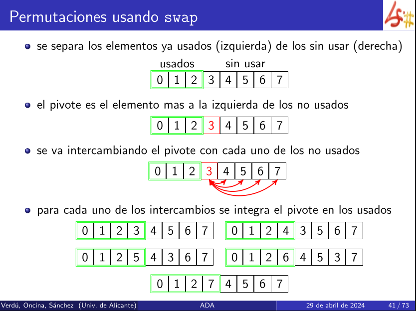

Muestra todas las permutaciones de una secuencia (0,...,n-1).

> [!example] Datos
> x: vector de soluciones
> k: limite 
> c: elemento que se comprueba

- Cuando se llega a una hoja se imprime. 
- Si el elemento c que se comprueba ya ha aparecido antes se mete en el vector y se avanza. 

