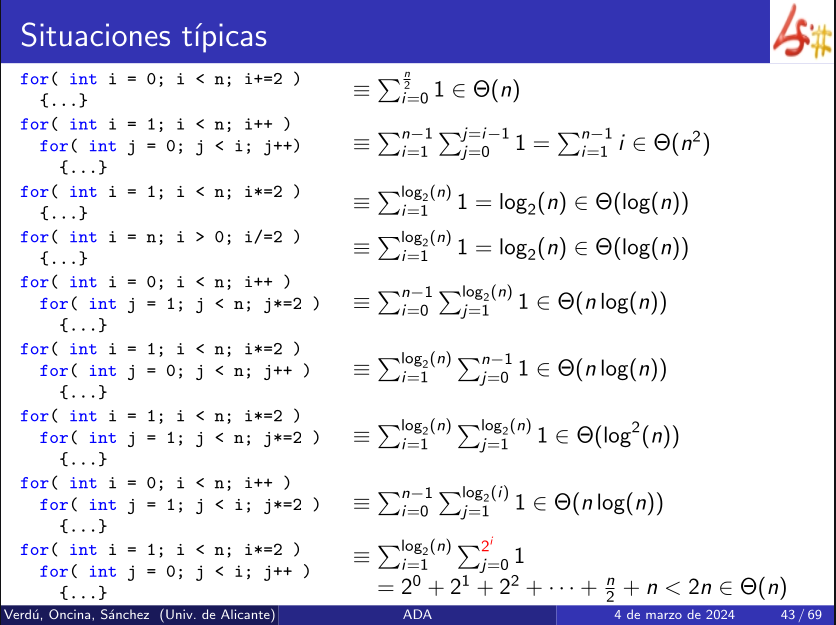

# SITUACIONES TÍPICAS



```c++
for( int i = 1; i < n; i*=2 ) 
	{...}
```

$i*=2$ -> reduce a la mitad el tamaño de problema cada vez. Por eso se trata de una complejidad logarítmica.

```c++
for( int i = 1; i < n; i*=2 ) 
	for( int j = 0; j < i; j++ ) 
		{...}
```

Se trata de una complejidad $O(n)$ porque se ejecuta de manera que el bucle interior se realiza n veces.

___
# Algoritmos Iterativos
## Traspuesta de una matriz

- Matriz cuadrada d x d:

```c++
// d = A.n_rows
void transpose(mat& A){
	for(size_t i = 1; i < d; i++)
		for(size_t j = 0; j < i; j++)
			swap(A(i,j), A(j,i));
}
```

$$T_d(d)=\underbrace{2+2(d-1)}_{\large{bucle\,exterior}}+\underbrace{\sum_{i=1}^{d-1}{(2+3i)}}_{\large interior}=···=O(d^2)$$

### Complejidad bucle interior

2 + 3i 

- 2 + 2i -> bucle for normal
- i -> el swap se realiza i veces porque depende del número de iteraciones del bucle interior (i).
- El sumatorio va desde 1 hasta d-1 porque en el bucle exterior hay un menor estricto (i < d).
### Complejidad bucle exterior

2 + 2(d - 1) 

- d - 1 -> el bucle for empieza en 1.

La complejidad se calcula en base a lo que ocupa la matriz en memoria pero el cálculo está hecho en base a d, que es el tamaño de la matriz cuadrada (tamaño de problema) $s=d^2$, luego:

$$T_s(s)=T_d(d)=O(d^2)=O(s)$$

**Complejidad:** lineal $O(s)$

___
## Producto de dos matrices

- Matrices d x d:

```c++
// d = A.n_rows
mat product( const mat &A, const mat &B ){
	mat R(d, d);
	for( size_t i = 0; i < d; i++ ) // 1
		for( size_t j = 0; j < d; j++ ) { // 2
			double acc = 0.0;
			for( size_t k = 0; k < d; k++ ) // 3
				acc += A(i,k) * B(k,j);
			R(i,j) = acc;
		}
	}
	return R;
```
### for 3
Es un bucle for básico que va de 0 a d.
**Complejidad**: $O(d)$
### for 2
$O(d)$ -> propio for
$1+O(d)+1$ -> interior del for (se obvia por que sigue siendo lineal), luego se queda en $d·O(d)$ porque el bucle se ejecuta d veces.
**Complejidad**: $O(d)+d·O(d)=O(d^2)$
### for 1
$O(d)$ -> propio for
El bucle se ejecuta d veces.
**Complejidad**: $O(d)+d·O(d^2)=O(d^3)$

___

La complejidad del algoritmo se calcula en base al tamaño de la matriz, luego:

$$T_d(d)=O(d^3)$$

La complejidad con respecto al tamaño del problema se calcula de la siguiente manera:

tamaño de problema = $s=2d^2$ -> $d=\sqrt{\frac{\Large s}{\large 2}}$

$$T_s(s)=T_d(d)=O(d^3)=O((\sqrt{\frac{s}{2}})^{\large 3})=O(s^{\frac{\Large 3}{\Large 2}})$$

> Complejidad espacial -> para realizar su labor cuanta memoria necesitaría
> Complejidad temporal -> evalúa el coste temporal 

___
## Búsqueda de un elemento en un vector

> NOT_FOUND -> valor centinela (valor imposible)
### Cotas superior e inferior

```c++
#include <limits>

const size_t NOT_FOUND = numeric_limits::max();

size_t find( const vector &v, int z ) {
	for( size_t i = 0; i < v.size(); i++ )
		if( v[i] == z )
			return i;
	return NOT_FOUND;
}
```
### Mejor caso

El elemento que se busca es el **primer elemento** del vector.
No depende del tamaño del vector. La ejecución del bucle se realiza una vez. 

- for
	- asignación -> 1
	- comparación -> 1
	- interior del for
		- comparación del if -> 1
		- return i -> 1
Total: 4

**Complejidad**: constante $O(1)$
### Peor caso

Cuando no se encuentra el elemento en el vector.

- for 
	- asignación -> 1
	- casos del for -> 3n (n veces, tamaño del vector)
	- return final -> 1
Total: 3n + 2 

**Complejidad**: lineal $O(n)$

___
## Elemento máximo de un vector

```c++
int max(const vector<int> &v) {
	int max = v[0];
	for( size_t i = 1; i < v.size(); i++ )
		if( v[i] > max )
			max = v[i];
	return max;
```

**No hay mejor y peor caso**. Para que lo hubiera tendría que depender del contenido del vector no del tamaño del vector. No modifica los elementos del vector, luego la ejecución del bucle for siempre se realiza n veces, siendo n el tamaño del vector.

En el caso de [Búsqueda de un elemento en un vector](#busqueda-de-un-elemento-en-un-vector) si que hay mejor y peor porque una vez se encuentra el elemento detiene la ejecución. Pero en este caso el bucle siempre se ejecuta n veces.

**Complejidad**: lineal $O(n)$

___
## Ordenación por selección directa

```c++
void selection_sort(vector<T> &v) {
	for(size_t i = 0; i < v.size()-l; i++) {
		size_t i_min = i;
		for (size_t j = i+l; j < v.size(); j++)
			if (v [j] < v[i_min])
				i_min = j;
		swap (v[i], v[i_min]);
```

**No hay mejor y peor caso**. Para que lo hubiera tendría que depender del contenido del vector no del tamaño del vector. No modifica los elementos del vector, luego la ejecución del bucle for siempre se realiza n veces, siendo n el tamaño del vector.

$$\sum^{n-1}_{i=0}\,\sum^n_{j=i+1}1$$

Sumatorio para el for interior: $(n-1)+(n-2)+···+1$, se podría sustituir por $i-1$.

> Dos bucles for ejecutados de forma lineal y dependientes de n ambos -> complejidad exponencial

**Complejidad**: $O(n^2)$ -> $O(\frac{\large n^2}{\large 2})$, que es del orden $O(n^2)$

___
## Búsqueda binaria en un vector ordenado

```c++
const size_t NOT_FOUND = numeric_limits<size_t>::max();
int binary_search(const vector<int> &v, int val){
	size_t first = O;
	size_t count = v.size();
	while(count > 0) {
		size_t step = count/2;
		size_t med = first + step;
		if(v[med] < val) {
			first = med + 1;
			count -= step + 1;
		}else
			count = step;
	
	//centinela por si nos pasan el vector vacío
	if(first < v.size() && v[first] == val)
		return first;
	else
		return NOT_FOUND;
}
```

Tamaño de problema -> tamaño del vector

**No hay mejor y peor caso**. El control con el centinela se hace al final de la ejecución, pero se evalúa el vector antes. La decisión de cerrar la ejecución se hace al final del algoritmo, para que hubiera mejor y peor caso eso tendría que realizarse al principio para detener la ejecución antes de hacer operaciones con el vector. 

No hay salidas adelantadas en el bucle while, se evalúa siempre independientemente del contenido del vector. Al igual que step se reduce siempre mientras se entre en el bucle, luego la complejidad va a ser log n.

**Complejidad**:  $O(log\,n)$

___
## Ordenación por inserción 

**Complejidad**: $O(n^2)$ 

___
# Algoritmos recursivos
## Búsqueda binaria en un vector ordenado

```c++
size_t lower_bound( const vector &v, int val, size_t first, int count) {
	if( count == 0 )
		return first;
		
	size_t step = count/2;
	size_t med = first + step;
	if(v[med] < val) { 
		return lower_bound(v, val, med+1, count - (step + 1));
	}else 
		return lower_bound(v, val, first, step );
}

int binary_search(const vector &v, int val) { 
	size_t first = lower_bound(v, val, 0, v.size()); 
	
	if(first < v.size() && v[first] == val) 
		return first; 
	else
	 return NOT_FOUND;
}
```

Tamaño del problema -> parte del vector que se utiliza (**count**).

**Hay mejor y peor caso**. 

Coste de las llamadas recursivas:

$$T(n) \in
	\left\{
		\begin{array}{lr}
			O(1) & n=0 &caso\, base\\
			O(1)+T(\frac{n}{2}) & n>0 & recursividad
		\end{array}
	\right.$$

$$T(n) \in O(log\, n)$$

El tamaño del problema se reduce al reducirse el count a la mitad con cada paso de programa.

___
## Ordenación por selección
```c++
void sort( vector<int> tv, size_t first) {
	if(first == v.size() )
		return ;
	int min = first;
	for (size_t i = first + 1;	i < v.size(); i++)
		if(v[i] < v[min])
			min = i;
	swap(v[min], v[first]) ;
	sort(v, first + 1); // llamada recursiva (n-1)
}
```

Tamaño del problema -> $n=v.size()-first$

> **No hay mejor y peor caso**.

Ecuación de recurrencia a partir del algoritmo. 

$$T(n) \in
	\left\{
		\begin{array}{lr}
			O(1) & n=0 &\\
			O(n)+T(n-1) & n>0
		\end{array}
	\right.$$

Recurrencia por sustitución

$$\sum_{j=1}^{n}=\frac{n(n+1)}{2}+1$$

$$T(n)\in O(n^2)$$
