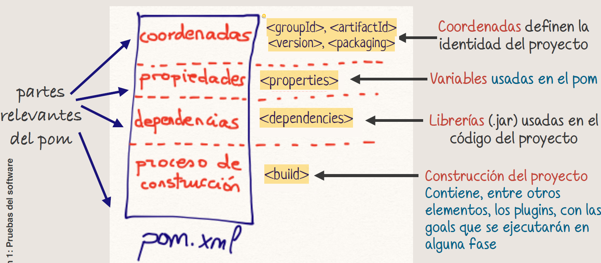

# Resumen 

- Hay 4 fases en el proceso de pruebas: **PLANIFICACIÓN**, **DISEÑO**, **IMPLEMENTACIÓN y EJECUCIÓN**, y **EVALUACIÓN**.
- Tres conjuntos principales: Conjunto **S**, la especificación; conjunto **P**, lo programado; y conjunto **T**, lo testeado.
- Objetivo, encontrar el **máximo número posible de defectos (EFECTIVIDAD)** con el **mínimo número de casos de prueba (EFICIENCIA)**.
- La automatización de pruebas se hace con Maven, que tiene tres ciclos de flujo. Ciclo de vida por **DEFECTO** (23 fases), Ciclo de vida **SITE** (4 fases) y Ciclo de vida **CLEAN** (3 fases).
- La estructura de los proyectos maven siempre es la misma, con dos carpetas principales donde se distribuyen el código y las pruebas, **src** y **test**. 
- Un **artefacto** es cualquier fichero que Maven puede identificar por `groupId:artifactId:version`, sus coordenadas.
- **Fase** - Representa un paso lógico dentro del ciclo de vida. 
- **Goal** - Es una tarea específica asociada a una fase.  
- **Plugin** - Conjunto de goals que pueden ejecutarse en diferentes fases.
- Las **fases** en maven se recorren siempre secuencialmente y muchas de ellas tienen asociadas **goals** por defecto.

___
# Pruebas del software
## Actividades del proceso de pruebas

1. **PLANIFICACIÓN** Y CONTROL. Se definen los objetivos de las pruebas. 
2. **DISEÑO**. Decidir los datos de entrada para probar el código para detectar el máximo número de errores en el menor tiempo posible.
3. **IMPLEMENTACIÓN** Y EJECUCIÓN. Creamos el código. Automatización de pruebas. 
4. **EVALUACIÓN**. Comprobación mediante métricas avanzadas, de los objetivos de pruebas planificados. 

___
## Pruebas y comportamiento

Dado un programa se consideran los conjuntos:

- ==Conjunto **S**==. Comportamientos especificados para el programa que **deberían cumplir las reglas según la especificación**.
- ==Conjunto **P**==. Conjunto de comportamientos programados. **Comportamientos reales que el programa puede manejar, según el código implementado**.
- ==Conjunto **T**==. Comportamientos probados, conjunto de tests. Se representa en tablas con casos de prueba y resultados esperados. Un *comportamiento* se identifica por sus datos de entrada + resultado. 

| **ID** | **d1** | **d2** | **Resultado esperado** |
| :----: | :----: | :----: | :--------------------: |
|   C1   |        |        |        output1         |
|   C2   |        |        |        output2         |

El objetivo es encontrar el **máximo número posible de defectos (EFECTIVIDAD)** con el **mínimo número de casos de prueba (EFICIENCIA)**.

___
## Procesos de diseño y automatización de pruebas

- Se seleccionan un **conjunto de comportamientos a probar**, representados en una tabla de casos de prueba.
- **Se obtienen** de forma automática...
	- **resultados reales** de las pruebas. 
	- **informe** que indica si se han obtenido los resultados esperados, si han sido exitosos o no.

La ejecución de los tests con Maven en prácticas siempre sigue las siguientes fases:

- **Compilar el código del programa**.
- **Compilar el código de las pruebas**.
- **Ejecutar las pruebas**.
- Generar un **informe automático** que muestra si los resultados coinciden con las expectativas.

___
## Maven

Es una herramienta para generar **build scripts**. Maven tiene 3 ciclos de vida.

- Ciclo de vida por **DEFECTO** (23 fases).
- Ciclo de vida **SITE** (4 fases).
- Ciclo de vida **CLEAN** (3 fases). 

Cada ciclo de vida tiene GOALS asociadas por defecto a *alguna* de sus fases. Cada fase sólo pertenece a un único ciclo de vida. 

**Un ciclo de vida ejecuta siempre las fases secuencialmente a través de sus goals asociadas**.

Ejemplos de fases: compile, test, package, clean, install...

Una FASE puede tener asociadas una o más goals. Cada GOAL es una **acción ejecutable**.
Una GOAL **siempre** pertenece a algún PLUGIN (conjunto de goals).

___
## Estructura de un proyecto Maven
### Estructura del pom.xml

El fichero pom.xml tiene 4 partes relevantes diferenciadas con etiquetas xml. 

[Estructura detallada del pom](Maven/pom.xml.md)
### Artefactos Maven

[Estructura detallada de los artefactos](Maven/Artefactos%20maven.md)
### Ejecución de Maven

Actúa como un disparador, en el que se ejecuta una goal concreta cuando se alcanza una fase determinada.

Esto implica que independientemente de la fase que ejecutes se van a ejecutar todas las anteriores hasta llegar a la especificada ya que la ejecución es siempre secuencial.

___

Siguiente -> [S02 - Pruebas de Caja Blanca](S02%20-%20Pruebas%20de%20Caja%20Blanca.md)