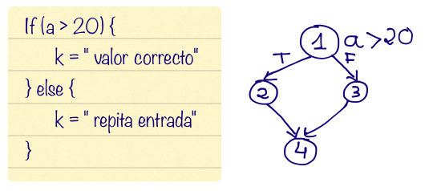

# Resumen

- En el proceso de diseño se generan **tablas de casos de prueba**.
- Cada **caso de prueba** es una combinación de **datos de entrada** concretos y **resultado esperado**. Cada caso de prueba representa un comportamiento a probar.
- Los **grafos de Flujo de Control (CFG)** son grafos dirigidos que representan los comportamientos (cada camino) de un código. Los **CFG** tienen exactamente los mismos comportamientos que el código asociado. 
- Cada entrada en la tabla de casos de prueba representa un **camino independiente**, que a su vez son conjunto mínimo de casos de prueba que garantiza un objetivo.
- La **Complejidad Ciclomática (CC)** es el número de caminos independientes.
- Los **datos de entrada** no siempre van a estar en los parámetros, y son valores arbitrarios, al igual que los **datos de salida** no siempre coinciden con el tipo de salida

___
# Pruebas de caja blanca
## Diseño de casos de prueba

El resultado de un proceso de diseño es una tabla de casos de prueba. Cada fila tiene los datos de entrada y el resultado esperado de un comportamiento del programa.

Cada fila de la tabla es un **CASO DE PRUEBA** = datos entrada concretos + resultado esperado.
Cada caso de prueba representa un comportamiento a probar.
### Structural testing


- **Se pueden detectar comportamientos no especificados, pero implementados:**
    - Esto ocurre porque, durante las pruebas, se ejecuta el código implementado, y si el comportamiento está en el programa aunque no esté en la especificación, puede ser descubierto por las pruebas.
- **No se pueden detectar comportamientos no implementados:**
    - Si algo no está implementado, no se puede probar ni detectar, ya que no hay nada en el código que represente ese comportamiento.

El resultado esperado se obtiene **SIEMPRE** de la especificación, esto es debido a que en la especificación se definen los comportamientos que el programa debería seguir, **que se deben implementar**. Los comportamientos probados podrían estar o no especificados. 

___
## Grafo de Flujo de Control (CFG)

Se usa un grafo dirigido.

- Cada **nodo** tiene una sentencia o grupo de sentencias secuenciales y/o única condición.
- Las **aristas** representan el flujo de ejecución entre dos conjuntos de sentencias secuenciales.


(4) contiene la llave final.

- Cada camino en el grafo corresponde con un **comportamiento**. 
- No puede haber más de un punto de salida hacia el mismo nodo (dos arcos salientes de un nodo).
- Tampoco puede haber bucles desde el mismo nodo (de 2 -> 2). 
- El grafo contiene exactamente los mismos comportamientos que el código asociado. El propósito del grafo es "visualizar" los comportamientos implementados (caminos en el grafo)

___
## McCabe's Basis path method

Permite ejecutar cada **camino independiente** en el programa. Garantiza el objetivo del método. 
El **objetivo** del método:

- Se ejecutan **TODAS** las sentencias del programa, al menos una vez.
- Se garantiza que **TODAS** las condiciones se ejecutan en sus vertientes. 
### Caminos independientes

Un **camino independiente** es un camino que recorre un nodo o una arista, como mínimo, que no se ha recorrido en un camino anterior.

Entre todos los caminos independientes no pueden quedar nodos o aristas sin recorrer.

> **Caminos independientes** -> conjunto mínimo de casos de prueba que garantiza un objetivo
### Descripción del método

1. Construir el **CFG** a partir del código a probar.
2. Calcular la **CC** (Complejidad Ciclomática) del grafo de flujo.
3. Obtener el **número de caminos independientes** del grafo.
4. Encontrar los valores que fuerzan que se recorran los caminos independientes.

Tabla resultante del diseño de las pruebas:

| Camino | Entrada 1 | Entrada 2 | ... | Entrada n | Resultado Esperado |
| :----: | :-------: | :-------: | :-: | :-------: | :----------------: |
|   C1   |    d11    |    d12    | ... |    d1n    |         r1         |
|  ...   |           |           |     |           |                    |
|   C2   |    d21    |    d22    | ... |    d2n    |         r2         |

Una columna para cada dato de entrada. Una columna para cada dato de salida.
El **resultado esperado** se obtiene de la especificación, conjunto S.
Los valores de entrada y salida deben ser CONCRETOS.

___
## Complejidad Ciclomática (CC)

Da una medida de la **complejidad lógica** (uso de muchas instrucciones de control) de un componente software. 

```
CC = nº arcos - nº nodos + 2
```

> **El CC determina el número de caminos independientes**. No tiene unidades. Número de ciclos.

A mayor CC, mayor complejidad lógica, mayor esfuerzo de mantenimiento y esfuerzo en las pruebas.
El máximo comúnmente aceptado es de 10.
### Otras formas de calcular el CC

CC = arcos - nodos + 2
CC = nº regiones
CC = nº condiciones + 1

Las últimas dos son aplicables solo si el código está totalmente estructurado (no breaks, goto...).

___
## Caminos independientes

Buscamos (como máximo) tantos caminos independientes como valor obtenido de CC.
El valor del CC es una cota superior de los caminos independientes.


Tabla resultante del diseño de casos de prueba.


Los **datos de entrada** son valores arbitrarios, mientras se cumpla la condición de las sentencias de condición que haya en el código. 
Los **datos de entrada** no siempre van a estar en los parámetros, al igual que los **datos de salida** no siempre coinciden con el tipo de salida (void).


___

Siguiente -> [S03 - Drivers](S03%20-%20Drivers.md)