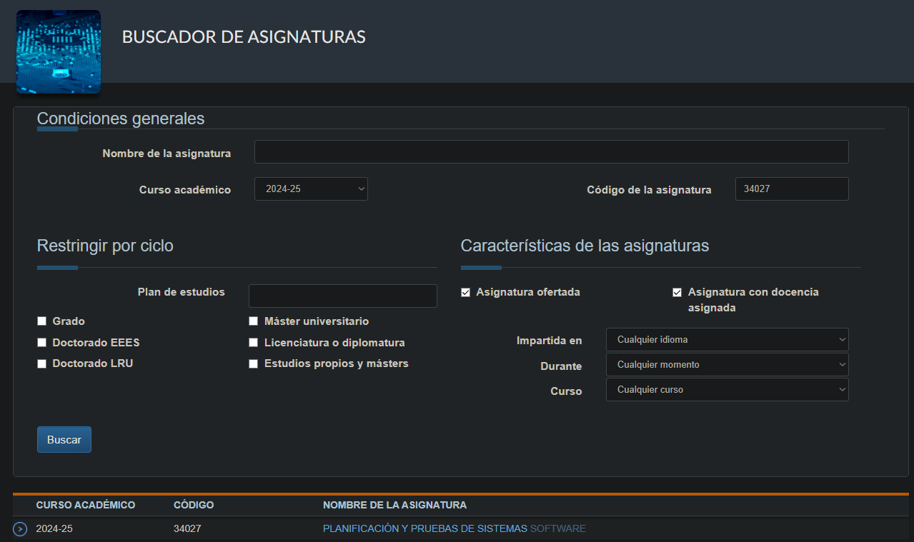

# Resumen

- Las **pruebas de aceptación** buscan confirmar que el sistema cumple los **criterios de aceptación** pactados y, por tanto, las **expectativas del cliente**.
- Se distinguen de las **pruebas de sistema**: estas verifican el comportamiento global desde la óptica del **desarrollador**; las de aceptación validan el valor de negocio desde la perspectiva del **usuario/cliente**.
- Casos de prueba:
    - **Sistema** → derivados de las **especificaciones** y casos de uso.
    - **Aceptación** → basados en **criterios** medibles o en **escenarios** reales de uso.
- Categorías de aceptación: **BAT** (Business Acceptance Testing, interno) y **UAT** (User Acceptance Testing, externo: α-tests con usuarios conocidos, β-tests con usuarios anónimos).
- Los **criterios de aceptación** se definen al inicio y deben ser **cuantificables** (corrección, rendimiento, fiabilidad, disponibilidad, etc.).
- Diseño de pruebas de aceptación: equipo independiente, enfoque **caja-negra**, dos métodos principales: por **requisitos** (cada requirement debe ser testable) y por **escenarios** (historias de usuario que encadenan varios requisitos).
- **Automatización web** habitual con **Selenium WebDriver**; buenas prácticas de mantenibilidad mediante el **Page Object Model** y patrones asociados (PageFactory, separación de locators y lógica de test).

___
# S08 - Pruebas de sistema vs aceptación

- El objetivo de las **pruebas de aceptación** es valorar en que grado el software desarrollado satisface las expectativas del cliente. Requiere los CRITERIOS DE ACEPTACIÓN.
## Pr. de sistema vs  pr. aceptación

| Aspecto                                   | **Pruebas de sistema**                                                                     | **Pruebas de aceptación**                                                                                                           |
| ----------------------------------------- | ------------------------------------------------------------------------------------------ | ----------------------------------------------------------------------------------------------------------------------------------- |
| **Propósito principal**                   | **Verificación**: **descubrir defectos derivados del comportamiento** global del software. | **Validación**: **demostrar** que el sistema **satisface** las expectativas y requisitos pactados con el cliente.                   |
| **Enfoque / punto de vista**              | **Desarrollador** (visión interna del equipo).                                             | **Usuario / cliente** (visión externa de uso real).                                                                                 |
| **Base para diseñar los casos de prueba** | Requisitos funcionales del sistema (especificaciones).                                     | Criterios de aceptación definidos y negociados con el cliente.                                                                      |
| **Momento en el ciclo de pruebas**        | Tras la integración completa de componentes, antes de la entrega.                          | Una vez aprobado el sistema internamente; justo antes de ponerlo en producción.                                                     |
| **Salida esperada**                       | Informe de defectos encontrados y su gravedad.                                             | Dictamen de “aceptado” o “rechazado” (go/no-go para despliegue).                                                                    |
| **Tipos o variantes**                     | —                                                                                          | **BAT** (Business Acceptance Testing, ejecutado por la organización) y **UAT** (User Acceptance Testing, ejecutado por el cliente). |
| **Diseño de casos**                       | Caja negra basada en **casos de uso**; se centran en interacciones de componentes.         | Caja negra basada en **escenarios** o en los requerimientos; refleja tareas reales del usuario.                                     |
| **Resultado clave para el proyecto**      | Asegura que el producto está técnicamente correcto (cumple requisitos).                    | Confirma que el producto es el correcto para el cliente (valor de negocio).                                                         |

___
## Pruebas del sistema

- Obtienen los **casos de prueba** a partir de las **especificaciones** del sistema (caja negra).
- Durante el **proceso de desarrollo** y usan todos los componentes del sistema.
- Los comportamientos a probar son los especificados para el sistema en su conjunto.
- Ejemplos:
	- Método de diseño basado en **casos de uso**.
	- Método de diseño de **transición de estados**.
### Diseño basado en casos de uso

- Se comprueban **interacciones** y **compatibilidad** de componentes.
- Políticas para **reducir el número de casos** (menús, entradas correctas/incorrectas, funciones críticas).


___
## Acceptance Testing

> Un producto está listo para ser entregado al cliente después de que se hayan realizado las pruebas del sistema.

- Las pruebas de aceptación son pruebas orientadas a determinar si el sistema **satisface** los **criterios de aceptación**.
- Los criterios de aceptación de un sistema deben satisfacerse para ser aceptados por el cliente.

Hay dos categorías de pruebas:

- **User Acceptance Testing** (UAT). Dirigidas por el cliente para asegurar que el sistema satisface los criterios de aceptación contractuales. 
	- Pruebas **𝛂** (en el lugar de desarrollo para usuarios conocidos) y pruebas **𝛃** (para usuarios anónimos).
- **Business Acceptance Testing** (BAT). Dirigidas por la organización que desarrolla el producto para asegurar que se pasan las UAT.

___
## Acceptance Criteria

> Los criterios de aceptación se definen en etapas tempranas del desarrollo, pero los probamos al final del desarrollo, y después de haber verificado.

- La cuestión clave: **Qué criterios debe satisfacer el sistema para ser aceptado por el cliente?**
	- Calidad del sistema aceptable.
	- Criterios de aceptación deben ser **medibles** y **cuantificables**.

- Atributos de calidad:
	- **Corrección funcional y completitud**.
	- **Exactitud**, integridad de datos, **rendimiento**, **fiabilidad** y **disponibilidad**, mantenibilidad...

___
## Propiedades emergentes


---
## Diseño de pruebas de aceptación

- **Equipo de prueba independiente** del desarrollo (papel de “cliente interno”).
- Proceso **caja-negra** → se ignoran detalles de implementación.
- Dos enfoques de diseño:
    
    1. **Basado en requerimientos** (“cada requiremento debe ser _testable_”).
    2. **Basado en escenarios** (historias que encadenan varios requisitos).
    
- Cada caso de prueba necesita **datos concretos** de entrada y resultados esperados (pueden ser _secuencias de acciones_ del usuario).

---
### Diseño basado en requerimientos

- Principio IEEE 610-12 : un requisito debe escribirse “de forma que pueda derivarse una prueba”.
- Un **solo requisito** suele requerir **varios tests** (cubrir valores válidos / inválidos, caminos alternativos, etc.).

---
### Diseño basado en escenarios

- El escenario describe **cómo** el usuario usa el sistema (“actor → objetivo → flujo”).
- Cada escenario **ejercita múltiples requisitos** y, por tanto, múltiples componentes.

___


___
## Automatización de pruebas (Selenium WebDriver)

- **Objetivo** : reproducir las acciones del usuario en una aplicación web.
- **WAUT**: Web Application Under Test.

**Setup mínimo**:

```xml
<dependency>
	<groupId>org.seleniumhq.selenium</groupId>
	<artifactId>selenium-java</artifactId>
	<version>4.31.0</version>
	<scope>test</scope>
</dependency>
```

**WebDriver básico**:

```java
WebDriver driver = new ChromeDriver(); // "driver" representa un navegador (una sesión abierta)
driver.get("http://www.google.com"); // acción sobre el navegador
WebElement box = driver.findElement(By.name("q")); // localizar un elemento en la página
box.sendKeys("search"); // interacción con los elementos de la página 
box.submit();
driver.quit(); // cerrar la sesión
```
### Elementos HTML más utilizados


### Localización de elementos

| Estrategia                            | Ejemplo                             | Notas                                 |
| ------------------------------------- | ----------------------------------- | ------------------------------------- |
| **By.id()**                           | `By.id("fname")`                    | Un id = único → más robusto.          |
| **By.cssSelector()**                  | `By.cssSelector("input.passfield")` | Segunda opción fiable.                |
| **By.xpath()**                        | `//input[@value='f']`               | Potente pero frágil si cambia el DOM. |
| **By.linkText() / partialLinkText()** | —                                   | Para enlaces.                         |


### Acciones frecuentes

- **sendKeys, clear, click, submit** sobre `WebElement`.
- **Select** para `<select>`: `new Select(elem).selectByVisibleText("…")`.
- **Actions** builder para secuencias complejas (_drag&drop_, múltiple click…).
- Esperas
    - **Implícita**: `driver.manage().timeouts().implicitlyWait(10, SECONDS);`. Es común a todos los WebElements y tiene asociado un timeout global para todas las operaciones del driver.
    - **Explícita**: `new WebDriverWait(driver, 10).until(ExpectedConditions…);`. Se establece de forma individual para cada WebElement.

> No mezclar ambos tipos en el mismo test.


___
## WebDriver y Maven

Incluimos la dependencia con la librería de WebDriver:

```xml
<dependency>
	<groupId>org.seleniumhq.selenium</groupId>
	<artifactId>selenium-java</artifactId>
	<version>4.31.0</version>
	<scope>test</scope>
</dependency>
```
### Donde implementamos los tests de aceptación

- En `src/test/java` junto con el resto de drivers del proyecto. Serán ejecutados por `failsafe`
- En `src/test/java` de un proyecto maven independiente (que solo contiene los tests de aceptación). Serán ejecutados por `surefire`. (Solo si en src/main no están los fuentes del proyecto).

___
## Patrones de mantenibilidad
### Page Object Model (POM)

El método **Page Object** se basa en delegar y separar la creación de objetos y acceso a los campos de la web, a clases que representan una página completa de la web.
Este acceso se realiza mediante funciones que llaman a los selectores correspondientes.

- **Ventajas** : aísla a los tests de los cambios en el HTML, reduce duplicidad y facilita la mantenibilidad.
- **PageFactory** (`PageFactory.initElements(driver, LoginPage.class)`) inyecta los elementos anotados con **@FindBy** de forma _lazy_.
### Page Object Pattern

```
LoginPage
 ├─ userId (WebElement)
 ├─ password
 ├─ loginButton
 └─ login(user,pass) → ManagerPage
```


---
## Mantenibilidad de los tests

- Los tests fallarán si cambian _locators_ → **refactorizar solo la _Page Object_**, nunca todos los tests.
- Seguir las buenas prácticas POM: **un servicio por método**, **un elemento por campo** y **sin lógica de aserción** dentro de la página.

---

## Ejemplo de flujo completo (UA.es)

1. Navegar a `https://www.ua.es`.
2. Hacer click en **Estudios** (2.º enlace).
3. Seleccionar **Grados Oficiales** → comprobar `title`.
4. Scroll hasta **BUSCADOR DE ASIGNATURAS** y click.
5. Introducir código `34027` y buscar.
6. Validar texto **PLANIFICACIÓN Y PRUEBAS DE SISTEMAS SOFTWARE**.



___
# Conclusiones

- **Sistema** = verificación técnica global; **Aceptación** = validación de valor de negocio.
- Ambos niveles se automatizan hoy con **herramientas web** y patrones de diseño que favorecen la **mantenibilidad**.
- La clave en aceptación: **criterios claros, medibles y acordados**; la clave en sistema: **cobertura funcional completa** desde la óptica del desarrollador.
