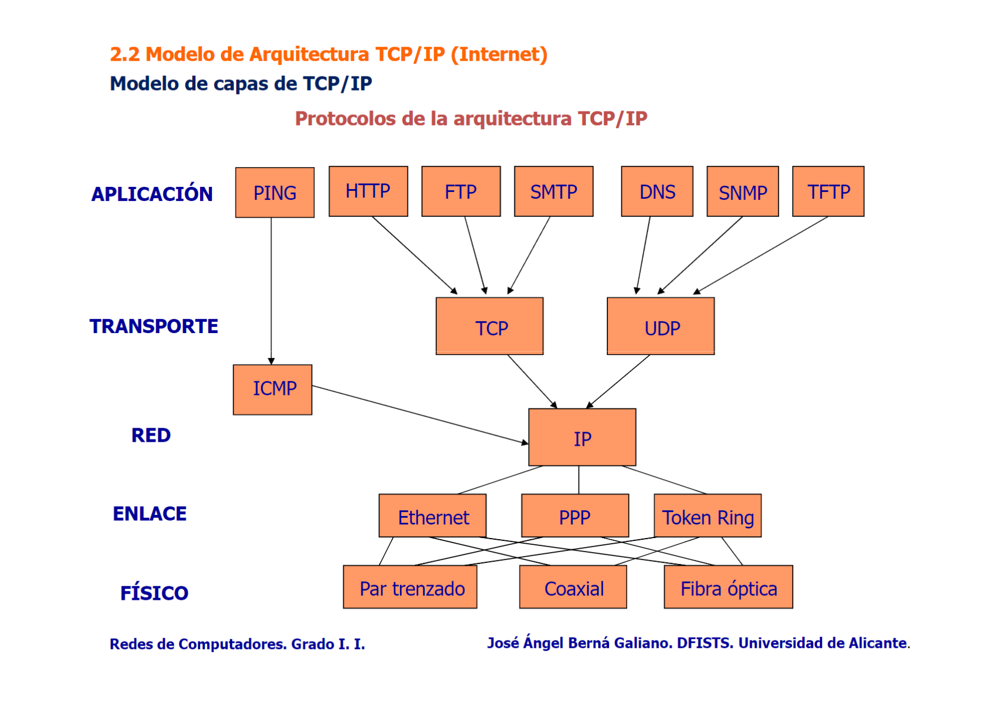

# 2. Arquitectura de red
## 2.1 Modelo de capas
Definiciones:
- **Capa o nivel**: niveles de abstracción de la comunicación.
- **Entidades pares**: instancias de una capa en cada extremo.
- **Protocolo**: normas para la comunicación entre entidades pares.
- **Servicios**: funciones que ofrece una capa a su capa superior.
- **Interfaz**: normas para la comunicación entre capas adyacentes.
### Ejemplo de arquitectura de red

## 2.2 Modelo de la Arquitectura TCP/IP (Internet)
Modelo de capas de TCP/IP:

PDU - Protocol Data Unit. Unidad de datos específica de un protocolo.

SDU - Service Data Unit. Unidad de datos que un protocolo recibe del nivel superior. 

La fragmentación ocurre cuando una SDU no cabe dentro de una PDU del mismo nivel, esto implica que la SDU debe dividirse en partes más pequeñas, cada una de las cuales se empaqueta en una PDU separada.

**Nivel 5: Aplicación**

**Nivel 4: Transporte** 

**Nivel 3: Red**

**Nivel 2: Enlace de datos**

**Nivel 1: Medio físico**

Nivel **N**:

- **SDU**: Datos recibidos del nivel n+1 (nivel superior).

- **PDU**: Datos encapsulados con encabezados e información del nivel n.

Nivel **N-1**:

- **SDU**: La PDU del nivel n se convierte en la SDU del nivel n-1.

- **PDU**: Datos encapsulados con encabezados e información del nivel n-1.

### Capa de aplicación
Conjunto de aplicaciones de Internet para la comunicación.

Protocolo **HTTP**.
### Capa de transporte
Control de comunicación de extremo a extremo en Internet. Interfaz entre la capa de aplicación y la de red para la gestión de la comunicación extremo a extremo.
Protocolos **TCP y UDP**.

**TCP**: protocolo de control de transmisión (fiable). Orientado a la conexión, entrega fiable de datos, control de flujo y gestión de congestión. No es muy adecuado para la multidifusión, pero es posible.

**UDP**: protocolo de datagramas de usuario (no fiable). No orientado a la conexión, simplemente envía los datos sin garantizar que lleguen a su destino. Naturalmente más adecuados para la multidifusión. Gestión de conexión por sockets
### Capa de red
Permite el encaminamiento de paquetes entre dos equipos de la red.

Identificación de equipos en una red.

**Direccionamiento IP**:

- Identificadores de 32 bits (x.x.x.x -> 0-255.0-255.0-255.0-255).

- Máscara de red (255.255.255.0)

- Subredes según una máscara de red (192.169.17.X):

	- 192.169.17.0 -> Dirección de red (no utilizable)

	- 192.169.17.1

	- 192.169.17.2

	- 192.169.17.255 -> Dirección de broadcast (no utilizable)
	
### Capa de enlace 
Define los mecanismos para el intercambio de información en un medio físico. Permite el envío de paquetes procedentes de la capa de **red** a través de un medio físico.
Protocolo **Ethernet**, **PPP** y **Token Ring**.
### Capa física 
Medios físicos para la comunicación en internet. Cable par trenzado, fibra óptica...

## 2.3 Interconexión de redes
### A nivel de red. Encaminador (router)
Menor rendimiento de interconexión que un puente.

Aplicable a cualquier segmento de red bajo el protocolo IP.
### A nivel de enlace. Puente (bridge)
Buen rendimiento (evita transmisiones innecesarias).

Limitado en cuanto al tipo de redes que puede interconectar
### A nivel físico. Repetidor (repeater)
Bajo coste instalación sencilla.

Poco rendimiento y colisiones permanentes.