# 3. Nivel físico
**DTE**: Equipo Terminal de Datos.

**DCE**: Equipo Terminador de Circuito de Datos

> Una señal está compuesta por infinitos armónicos.
## Transmisión de una señal de datos
### Señales de Fourier
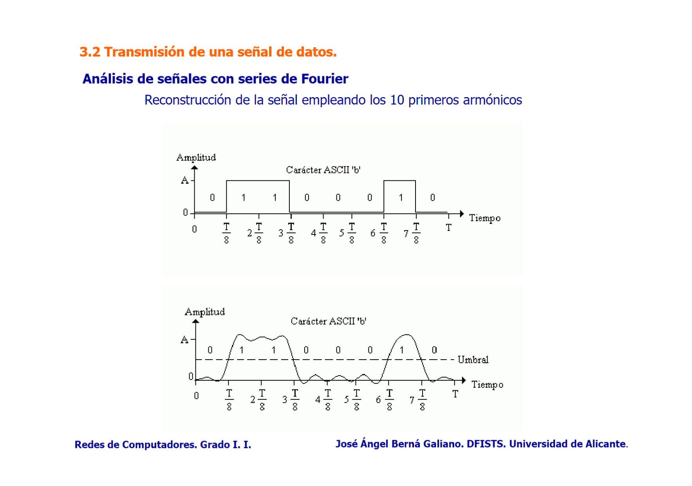

Ancho de banda de un medio físico: $B=f_c-f_o\ Hz$ .

### Teorema de Nyquist
Fórmulas:
$$ V_m=2B\ Hz $$
$$ V_{t(max)}=V_m·\log_2 n = 2B·\log_2 n\ bps $$
n = número de niveles de la señal
### Teorema de Shannon
Fórmulas:
Relación señal-ruido (signal to noise ratio) = $10·\log_{10} \frac{P_s}{P_n}\ dB$
Velocidad máxima de transmisión en un medio físico: $$ V_{t(max)}=B·\log_2(1+\frac{P_s}{P_n})\ bps $$
### Tipos de ruido según su origen
#### Ruido cruzado (crosstalk o diafonía)
Ruido causado cuando la señal de un cable se acopla (interferencias) a la de otro cable adyacente. Las señales electromagnéticas del primer cable afectan al segundo, lo que puede causar pérdidas de datos o errores de transmisión. Es común en cables par trenzado. 
#### Ruido de auto acoplamiento
Ocurre cuando una señal en un cable se refleja en sí misma debido a imperfecciones del cable o de las conexiones causando interferencia con la señal original. 
#### Ruido de impulso
Se manifiesta como picos de alta energía y corta duración en la señal. Puede ser causado por fuentes externas como motores eléctricos, interruptores, relámpagos o equipos eléctricos defectuosos. 
Puede causar errores de bits significativos en las transmisiones de datos.
## Señalización en banda base
### Codificación binaria
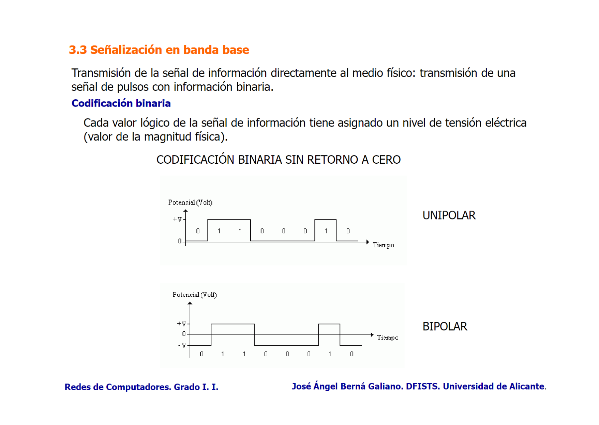
### Codificación Manchester
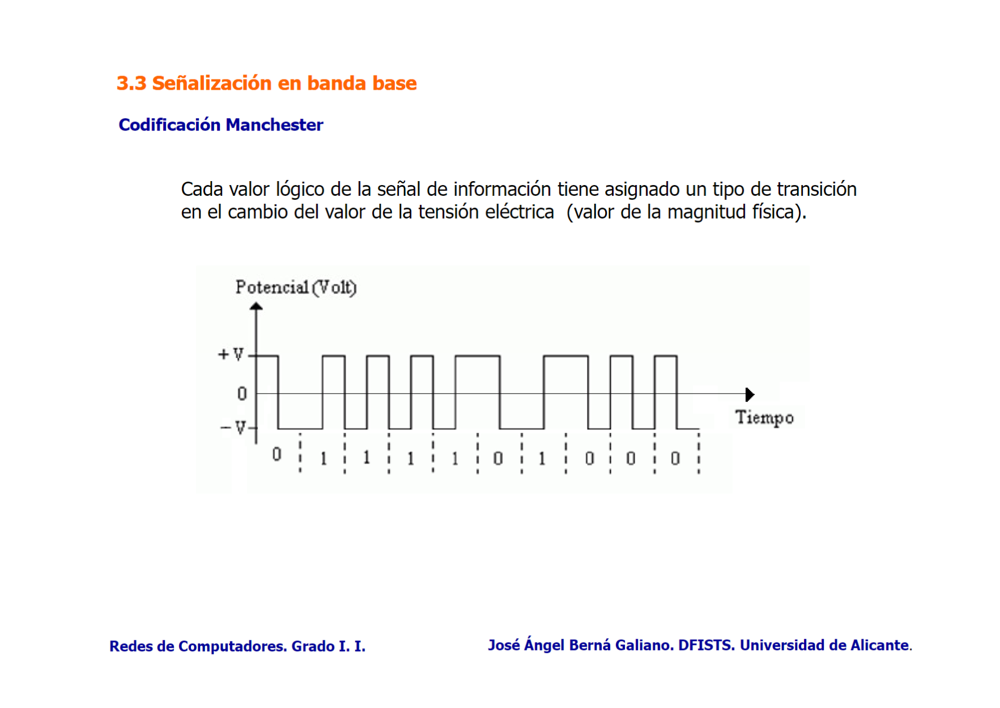
## Señalización en banda modulada
[Modulaciones y usos](Modulaciones y usos.md) 

Tres tipos de señales:
### Señal moduladora 
Información a transmitir.
### Señal portadora
Señal con las características de transmisión al medio físico.
### Señal modulada 
Señal portadora transmitida modificada según la señal moduladora.
### Modulación analógica
>Señal moduladora: DIGITAL
>Señal portadora: ANALÓGICA (la onda que se transmite)
#### ASK (Amplitude Shift Keying)
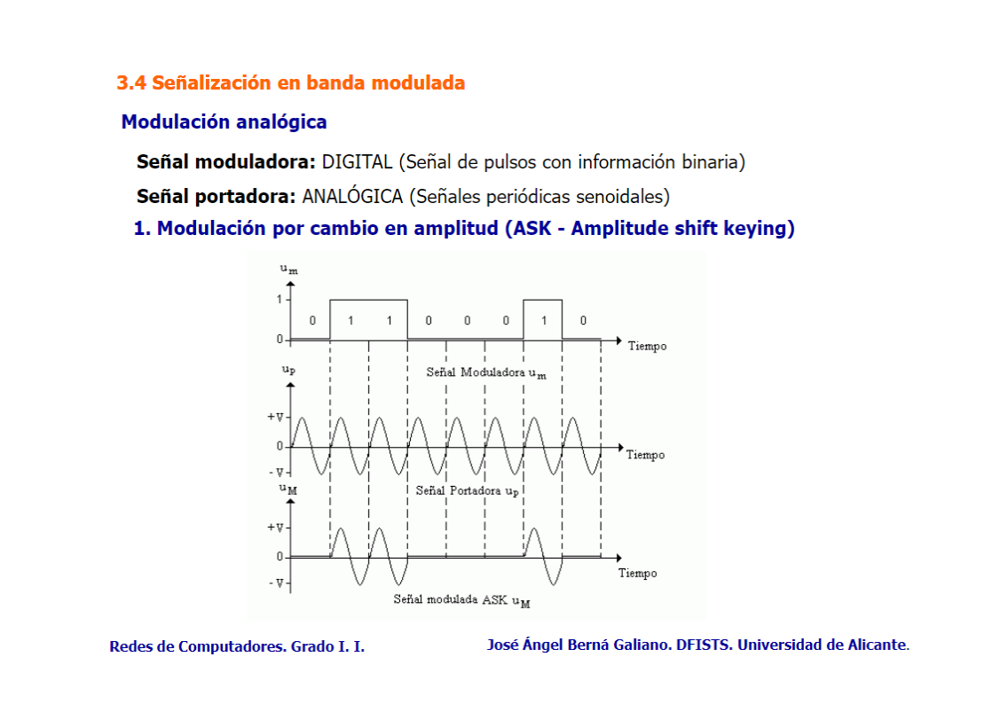

Se utiliza en aplicaciones donde el ancho de banda es limitado. Radiofrecuencia de baja velocidad y comunicaciones ópticas.
#### FSK (Frequency Shift Keying)
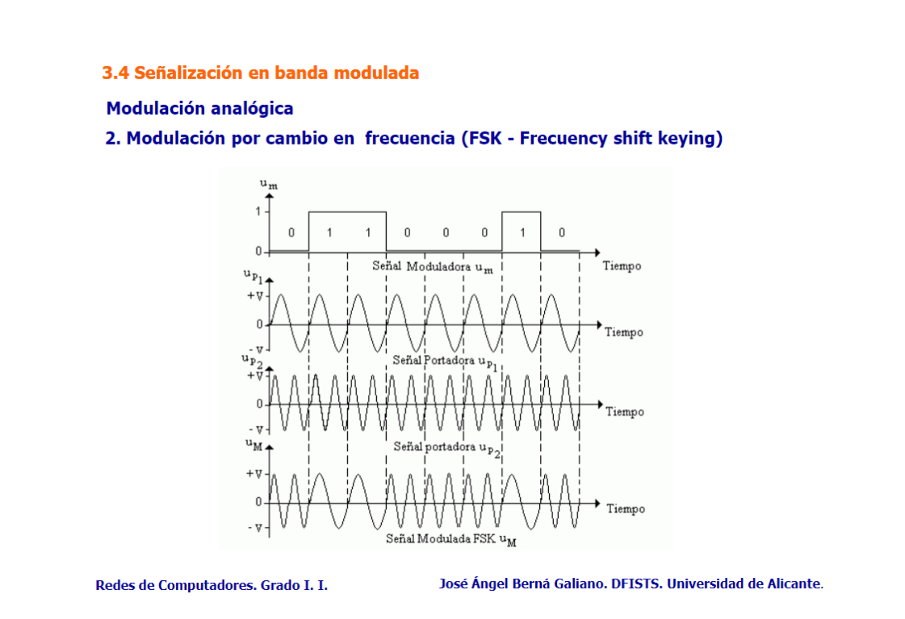

En FSK dos frecuencias portadoras distintas representan los dos valores de datos binarios (0 y 1) en una señal digital.

Se usa en aplicaciones de radiofrecuencia, telemetría y primeras generaciones de telefonía móvil. Comunicaciones inalámbricas de baja velocidad como bluetooth. 
#### PSK (Phase Shift Keying)
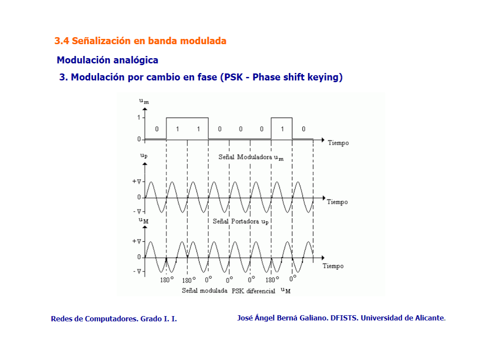

Cuando la entrada digital es 1 cambia la fase de la onda.

Comúnmente usado en aplicaciones que requieren alta eficiencia espectral como la transmisión de datos por modem sobre líneas telefónicas, en sistemas de comunicación por satélite y redes Wifi.
### Modulación analógica en múltiples niveles
#### QPSK (Quadrature Phase Shift Keying)
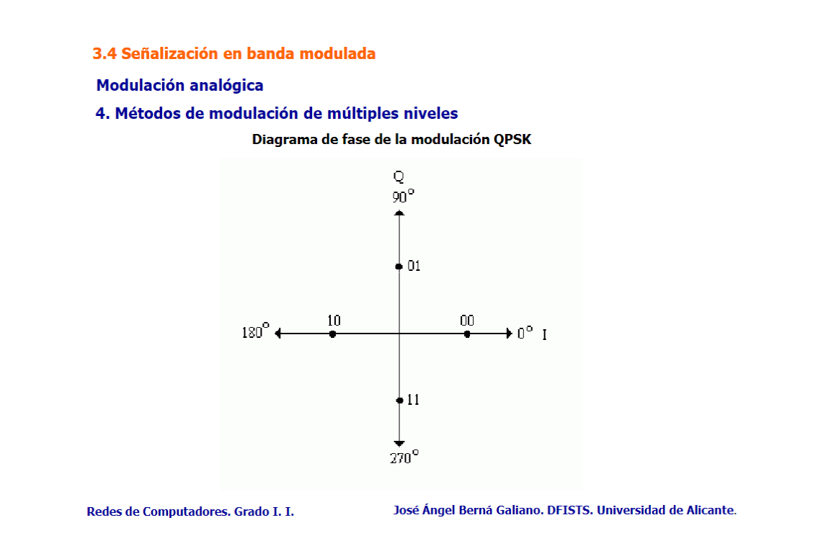

Como PSK pero con dos bits por cuadrante. 

Comunicación vía satélite, servicios de televisión por satélite y algunas formas de comunicaciones móviles. 
#### QAM (Quadrature Amplitude Modulation)
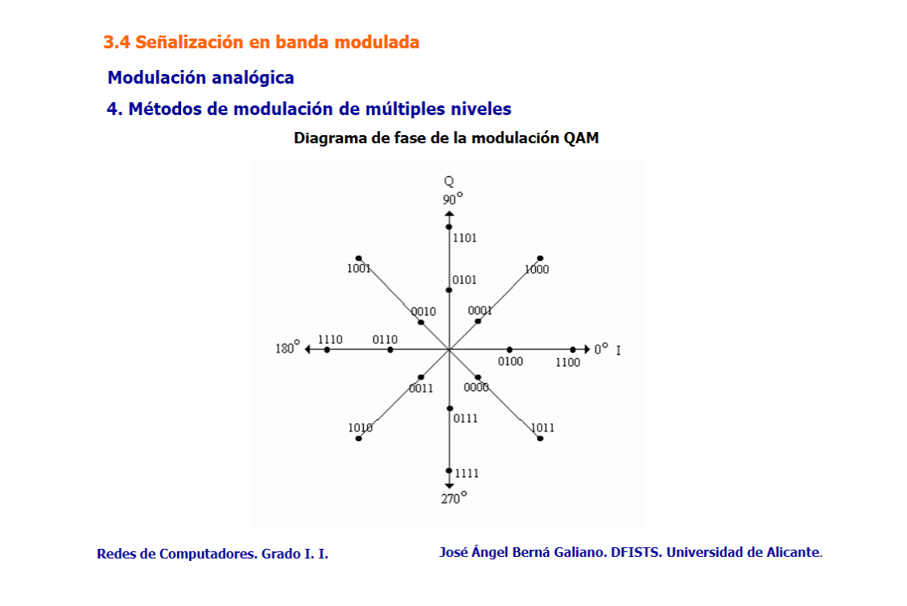

Combina ASK y PSK para crear diferentes amplitudes y fases de la onda portadora, lo que permite transmitir múltiples bits por símbolo.
Ampliamente utilizada en aplicaciones que requieren una alta eficiencia espectral y capacidad de transmisión, como la televisión por cable digital, modems de cable y tecnologías de comunicación móvil como LTE y 5G.
### Modulación digital 
>Señal moduladora: ANALÓGICA (la onda que se transmite)
>Señal portadora: DIGITAL
#### PCM (Pulse Code Modulation)
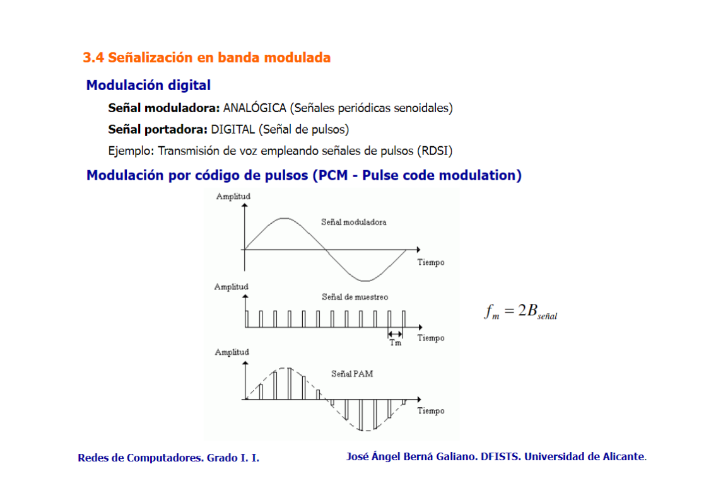

Uso en sistemas de comunicación de audio digital, telefonía digital y transmisión de audio sobre internet. También en la grabación de vídeo digital y transmisión de datos en redes de telecomunicaciones.
## Multiplexión
[Multiplexión](Multiplexión.md)
### Multiplexión por división de frecuencias (FDM)
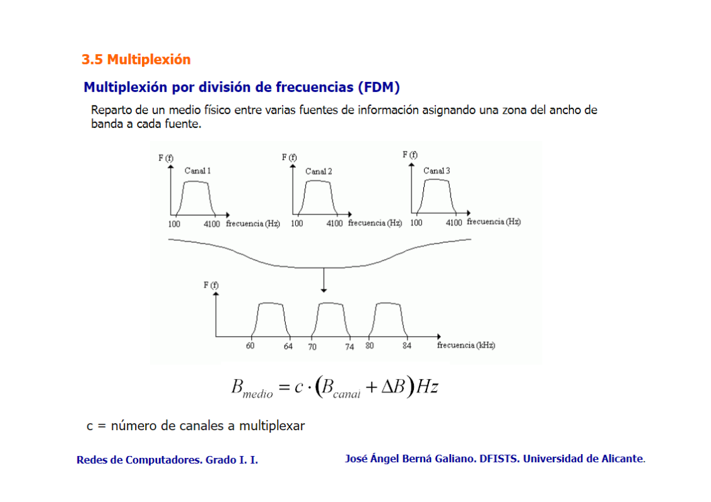

### Multiplexión por división en el tiempo (TDM)
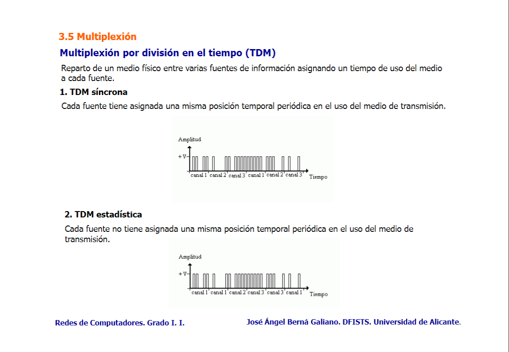
## Medios de transmisión
[Medios de transmisión](Medios de transmisión.md)
### Cable par paralelo
$V_t \le 20\ Kbps$, distancia máxima 50 m
### Cable par trenzado no blindado (UTP) 
Tipos de cable UTP:

- Categoría 3: Presentan un mayor índice de ruido cruzado.

- Categoría 5: $V_t \le 100\ Mbps$, máx. 100 m.

- Categoría 6: $V_t \le 1000\ Mbps$, máx. 100 m.

- Categoría 7: $V_t \le 10\ Gps$, máx. 100 m.

### Cable coaxial blindado (STP) 
$V_t=1000\ Mbps$, máx. 100 m.
#### Cable coaxial 50 Ohmios
- Banda base, codificación Manchester.
- Redes LAN.
- V de 10 Mbps a 100 m para cable fino.
- V de 10 Mbps a 500 m para cable grueso.
#### Cable coaxial 75 Ohmios
- Banda modulada
- Multiplexión en frecuencia de múltiples canales
- Tv analógica, por cable
### Fibra óptica
#### Fibra multimodo de índice de salto
Muchos haces de luz que se reflejan de pared a pared en el interior del cable, **dispersión intermodal.**
#### Fibra multimodo de índice gradual
Los haces de luz se reflejan hacia el eje (centro) del cable.
Utilizada actualmente en comunicaciones.
#### Fibra monomodo
Propagación de un único haz de luz paralelo al eje de la fibra. No hay dispersión intermodal (no hay reflexiones de luz), pero las distintas longitudes de onda generan distorsiones (**dispersión intramodal**).

| **Tipo de Fibra**             | **Pulsos de Luz**                               | **Haces de Luz**                                  |
| ----------------------------- | ----------------------------------------------- | ------------------------------------------------- |
| **Monomodo**                  | Pulsos claros en un único modo de propagación.  | Un único haz altamente colimado (láser).          |
| **Monomodo WDM**              | Pulsos en diferentes longitudes de onda.        | Múltiples haces de diferentes longitudes de onda. |
| **Multimodo Índice de Salto** | Pulsos distribuidos en varios modos.            | Múltiples haces en diferentes trayectorias.       |
| **Multimodo Índice Gradual**  | Pulsos más alineados gracias al índice gradual. | Múltiples haces "doblados" hacia el centro.       |

___

## [Resumen comparativo de las técnicas de modulación y multiplexión](Resumen comparativo de las técnicas de modulación y multiplexión.md)
