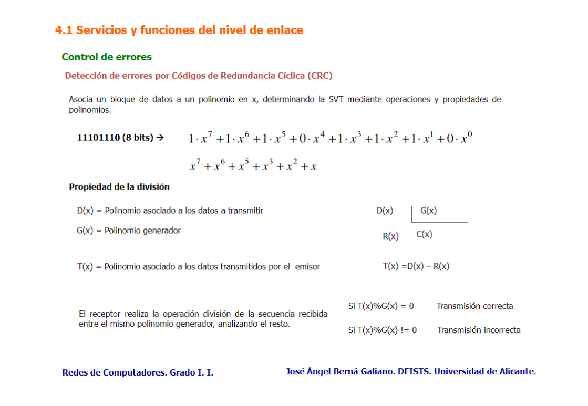

Utiliza polinomios y operaciones algebraicas para generar un valor de CRC de los datos antes de la transmisión. Este valor se envía junto con los datos. El receptor realiza el mismo cálculo en los datos recibidos, incluyendo el valor de CRC transmitido, y si el resultado es el valor esperado (por lo general 0), los datos se consideran sin errores.

Se utiliza en protocolos como Ethernet para asegurar la integridad de datos.

