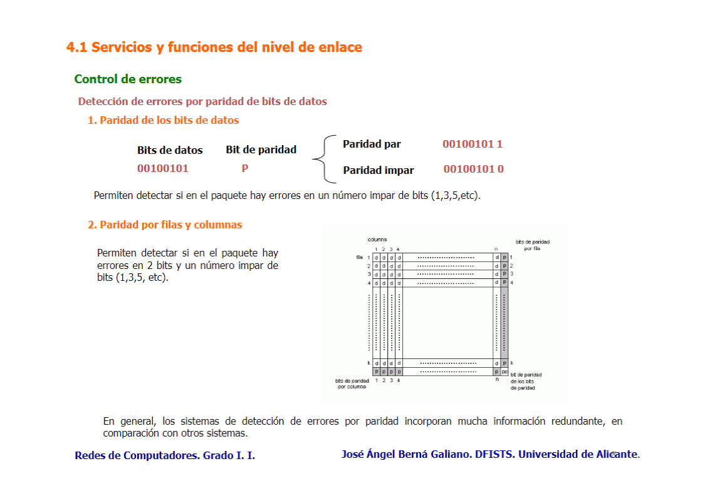

La verificación de paridad es una técnica simple que se puede utilizar para detectar errores en un solo bit. Consiste en **añadir** un bit adicional, **el bit de paridad**, a los datos antes de la transmisión. Este bit se establece de tal manera que el número total de bits establecidos a 1 en los datos, incluyendo el bit de paridad, sea par (paridad par) o impar (paridad impar). El receptor verifica si la paridad de los datos recibidos coincide con la esperada, lo que permite detectar errores en un solo bit.

