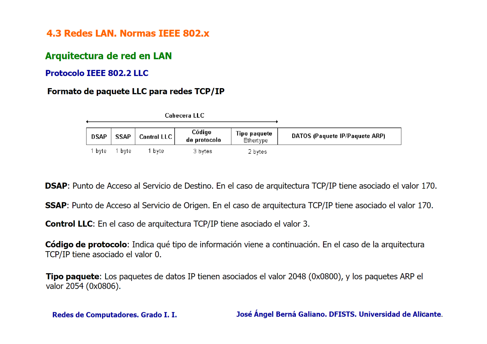

Redes LAN (Local Area Network). Interconexión de equipos en un segmento físico compartido y reducido. 

Velocidades de 10 Mbps - 10Gbps.
Comunicación con cables eléctricos, fibra ópticos y comunicación inalámbrica. 
Las topologías en LAN comunes:
### Bus común
Todos los dispositivos conectados a un cable central (bus). 
Fácil de instalar y mantener. 
Alta probabilidad de colisiones ante el envió simultáneo desde varios dispositivos. 
### Estrella
Todos los dispositivos están conectados a una nodo central (hub o switch). Los datos pasan primero por el nodo central y este redirige adecuadamente. 
Si el nodo central falla toda la red se ve afectada. Mayor costo. 
### Malla
Cada dispositivo está conectado a todos en la red. Los datos pueden viajar por múltiples caminos desde el origen al destino. 
Alto costo de implementación debido a los cables y puertos necesarios. 
Alta tolerancia a fallos, si un enlace falla, los datos pueden tomar otro camino. 
### Anillo 
Los dispositivos están conectados en un anillo cerrado. Los datos viajan en una dirección o en ambas, pasando por cada dispositivo hasta llegar el destino. 
Colisiones raras por los tiempos de acceso por dispositivo. 
## Arquitectura de red en LAN
Se incorpora el modelo del IEEE en el modelo TCP/IP.

- **LLC**: Control del Enlace Lógico. Funcionalidad de control de flujo y errores.
- **MAC**: Control de Acceso al Medio. Reparto del medio físico, direccionamiento físico, etc.
## Arquitectura IEEE 802
### IEEE 802.2 (LLC)
Protocolo de Control de Enlace Lógico (LLC).

#### Integración TCP/IP con IEEE 802
![[Temas Redes.pdf#page=130]]
### IEEE 802.3 
Ethernet CSMA/CD.
Se caracteriza por el uso de un **medio físico compartido** entre todas las estaciones con topología de bus. 
Las redes Ethernet son **semidúplex** (transmisión bidireccional no simultánea), debido a la necesidad de compartir el medio físico, y emplean el mecanismo **CSMA/CD** para el reparto de este.
#### Nomenclatura Velocidad - Señalización - Medio físico
Velocidad - **10** (Mbps), **100** (Mbps), **1000** (Mbps), **10G** (Gbps)
Señalización - **Base** (banda base, **Manchester**) o **Broad** (banda modulada)
Medio físico - **T** (cable UTP), **C** (cable STP), **F** (fibra óptica), **X** (soporte de varios medios físicos). 
#### 10Base2
Una de las primeras versiones de Ethernet. Velocidad de 10 Mbps hasta 185 metros. 
#### 10Base5
Emplea cable coaxial grueso, permitiendo una velocidad de 10 Mbps a distancias de hasta 500 metros.

10Base2 y 10Base5 desaparecieron con la introducción del cable STP.
MTU máximo es de 1492 bytes.

![[Temas Redes.pdf#page=135]]
#### Ethernet II (Ethernet DIX)
No utiliza la capa LLC, permite introducir el datagrama IP en el paquete de nivel MAC.
![[Temas Redes.pdf#page=136]]
#### CSMA/CD
Acceso al medio con detección de portadora y de colisión. Tanto Ethernet 802.3 y Ethernet DIX utilizan el mismo mecanismo para compartir el bus común: CSMA/CD.
CSMA/CD comprueba el medio físico antes de transmitir un paquete de datos. Su esquema de funcionamiento es **semidúplex**.
#### 10BaseT
Concentrador Ethernet (hub) **UTP**. Velocidad de 10 Mbps y 100 metros.
Un cable UTP comercial está formado por 4 pares de hilos trenzados. Topología en estrella.
#### Puentes y puentes transparentes
La interconexión Ethernet se puede mejorar empleando **puentes** o **bridges**. Un puente lee *todos* los paquetes recibidos por un puerto.
Los puentes filtran el tráfico de red inspeccionando las direcciones MAC de origen y destino de las tramas.
- Si una trama está destinada a una MAC en el mismo segmento de donde proviene el puente la descarta (no la reenvía). 
- Si está destinada a un segmento diferente la reenvía al segmento correspondiente. 

Los **puentes transparentes** deciden como los paquetes se intercambian entre segmentos, ya que los equipos no conocen la estructura de la red.
Son puentes que operan de manera invisible a los dispositivos de la red. No requiere de configuración manual de direcciones MAC y las aprende automáticamente.
- Cuando recibe una trama mira la dirección MAC origen y la almacena en su tabla de direcciones asociada al puerto de entrada.
- Revisa la MAC destino. Si conoce el puerto de destino reenvía solo por ese puerto. Si no, realiza un flooding, enviando a todos excepto por el que llegó la trama.
En un switch típico una dirección MAC está asociada a un único puerto. Direcciones MAC origen.

Los puentes filtran tramas innecesarias, reduciendo el tráfico en cada segmento de la red. 
##### Algoritmo Spanning Tree
Algoritmo de árbol de expansión.
Define un protocolo de comunicación entre puentes que consigue una estructura de LANs interconectadas por puentes **sin bucles**. Se encuentra en la norma IEEE 802.1D MAC Bridge. 

- Se elige el **puente raíz**.
- Se determina el coste RPC (número de redes intermedias, velocidad de transmisión) desde cada puerto al **puerto raíz**. El de menor coste se llama **puerto raíz del puente**. 
- En cada segmento se elige un **puerto designado**, que es el puerto con menor valor RPC que esté conectado al puerto designado. 
- Se activan todos los **puertos raíz** y **designados** de la red, determinando la estructura de árbol.
#### Ethernet conmutada
Los conmutadores o switches son los puentes multipuerto. 
- Modo **full-duplex**: No hay colisiones. Transmisión y recepción simultánea. 
- Modo **half-duplex**: Permite la conexión con CSMA/CD (concentrador 10BaseT). 
#### Fast Ethernet (IEEE 802.3u)
Arquitectura cliente/servidor.
Cliente - 10Mbps.
Servidor - 100Mbps. (Fast Ethernet)

Modo **half-duplex** (CSMA/CD) y **full-duplex**.
#### 100BaseX
Fast Ethernet, codificación **4B/5B**. Cables **UTP** categoría 5, **STP** y **fibra óptica**.
#### 100BaseFX
Emplea la normativa 100BaseX de codificación **4B/5B** sobre **fibra óptica** multimodo. Codificación **NZRI**.
#### 100BaseTX
Emplea la normativa 100BaseX de codificación **4B/5B** sobre cable **UTP categoría 5** (máximo 100 metros). Codificación **MLT-3** (3 niveles de amplitud de voltaje).
#### Gigabit Ethernet
Modo **half-duplex** (CSMA/CD) y **full-duplex**. 
#### 1000BaseT (IEEE 802.3z) 
Alcanza con cable **UTP categoría 5** velocidades de 1 Gbps en modo **full-duplex**. Codificación **4D-PAM5** (4 pares de hilos para transmitir y recibir simultáneamente).
#### 1000BaseX (IEEE 802.3ab) 
La transmisión de datos a 1 Gbps por fibra óptica es modificados con un codificador **8B/10B** La señal codificada puede transmitirse por **fibra óptica** o mediante cable **STP**.
#### 10 Gigabit Ethernet / 10GBase-XX (802.3ae)
Redes 10 Gigabit Ethernet (**10GBase-XX**) funcionan con full-duplex. Puede usar tanto **fibra óptica** como **STP**.
#### 40GBase-XX - 100GBase-XX (802.3ba)
#### 2.5GBase-T - 5GBase-T (802.3bz)
- Cable **UTP** categoría 4 - **2.5Gbps**.
- Cable **UTP** categoría 6 - **5Gbps**.
### IEEE 802.5 
Token Ring
### IEEE 802.1Q 
LAN Virtual (VLAN).
Puede dividir el conmutador en varios dominios de difusión distintos. Cada dominio de difusión **independiente** es una **VLAN** (Virtual Local Area Network). 
Permiten establecer un dominio de difusión para un conjunto de equipos conectados a un conmutador VLAN. 
Cada **VLAN** tiene asociada una IP diferente para que ARP funcione.
Id protocol: 0x8100.

Los **puertos troncales** (trunk ports) pertenecen a varias VLAN y a través de ellos se intercambian con conmutadores distintos. 
#### Enlaces troncales
Los conmutadores VLAN utilizan el protocolo **GVRP** (GARP VLAN Registration Protocol) para propagar la información entre conmutadores y conocer las VLANs asociadas a los puertos troncales. 
### IEEE 802.11x 
[[Redes LAN 1.1 - IEEE 802.11x LAN Inalámbricas]]