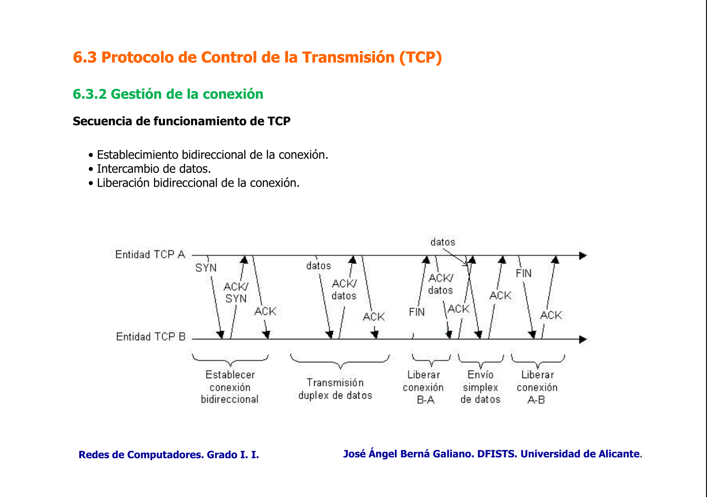

# Protocolo UDP
UDP - User Datagram Protocol.
- **No orientado a conexión**. 
- Trabaja con datagramas/paquetes enteros, no con bytes individuales como TCP.
- No es fiable. 
- Provoca poca carga adicional en la red. 
- Puede ser **fragmentado** por el protocolo IP. 
- Admite el uso de broadcast de la red IP.
## Formato de paquete
- **Puerto fuente** y **puerto destino**.
- Longitud.
- SVT.
# Protocolo TCP
TCP - Transmission Control Protocol.
- Trabaja con **flujo de bytes**. Entrega y recibe **bytes** **individuales**. TCP los agrupa en paquetes de tamaño adecuado para mejorar el rendimiento y evitar la fragmentación a nivel IP. 
- **Orientado a conexión**. 
- Es fiable. 
- Flujo de bytes ordenado.
## Formato de paquete
- **Puerto fuente** y **puerto destino**.
- Número de secuencia (SEQ).
- Número de ACK. 
- Flags: **ACK**, **PSH** (si = 1, indica que la capa de transporte debe pasar los datos a la capa de aplicación), **RST** (rechazo de la conexión), **SYN** (solicitar establecer una conexión) y **FIN** (liberar la conexión).
- Ventana.

En una conexión TCP al recibir un paquete TCP, después del proceso de conexión, el paquete necesita tener las cabeceras IP y ETH. Pero no se puede enviar porque en MTU de las redes ethernet es 1500. 
Un paquete TCP tiene que llegar a su destino sin ser fragmentado para que la red no sufra congestión. Se establece el MSS (cantidad máxima de datos de un paquete TCP).
El valor del MSS se determina a partir del valor del campo opciones en los paquetes SYN.

MSS = MTU - IP - TCP
MSS = 1500 - 20 - 20 -> 1460 
Ese será el tamaño máximo de los paquetes TCP.
MSS_datos = min{MSS_A, MSS_B}

La norma **RFC 1191** permite reducir el MSS si en una red intermedia entre el origen y el destino hay un MSS menor.
En la conexión, si se da el caso de que los paquetes tiene que atravesar una red intermedia el bit DF (don't fragment) debe estar activo a 1. Si estuviera activo, la máquina generaría un mensaje ICMP de error. La máquina sabe el paquete TCP que sufre el error porque en cabecera los 28 bytes, 20 son de la cabecera IP y los 8 restantes son los 8 primeros bytes de la cabecera TCP.
## Control del flujo
Se emplea un algoritmo de ventana deslizante $W_e = 7$, $W_r = 7$.
El control del flujo se realiza variando la ventana del receptor (campo window en la cabecera TCP).
- Si la ventana del receptor aumenta, el emisor puede enviar más información sin esperar a recibir ACKs.
- Si la ventana del receptor disminuye, el emisor envía menos información sin esperar a recibir ACKs. 
  
Cada vez que TCP recibe un ACK, la ventana del emisor permite enviar un nuevo fragmento. El emisor tiene especificado un tiempo de espera de ACK para cada segmento TCP. Si el ACK no llega se procede al reenvío del primer segmento sin ACK en la ventana del emisor. 
Para evitar reenvíos inútiles se espera al ACK del reenvío antes de reenviar un nuevo segmento TCP.
### Decremento multiplicativo
Se define en el emisor una nueva ventana llamada ventana de congestión, un valor en bytes igual que la ventana del emisor. 
La ventana del emisor se calcula como el valor mínimo de la ventana de congestión y la ventana que informa el receptor.
TCP supone que la expiración del timeout de un segmento es debido a la congestión, actualiza los valores:
- Reduce el tamaño de la ventana de congestión a la mitad.
- Multiplica x2 el timeout de los paquetes en la ventana del emisor.
De manera que conforme expiran temporizadores, el emisor envía cada vez menos datos.
